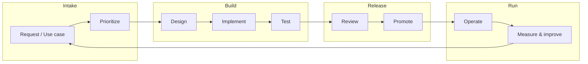

# Main Guide: Processes and Flows for Automation

This document is the entry point for the automation department white paper. It describes **how** automation is requested, designed, built, tested, operated, and improved—linking people, process, and technical structure.

---

## 1. Purpose and scope

The automation department delivers repeatable, auditable infrastructure and operations changes using **Ansible** and, where applicable, **Red Hat Ansible Automation Platform** (Controller, execution environments, workflows).

This guide applies to:

- New automation (greenfield)
- Changes to existing roles, playbooks, inventories, and workflows
- Retirement or replacement of legacy scripts

It does **not** replace vendor documentation; it defines **our** operating model on top of community good practices.

### Creating new automation?

Use the checklist (scaled by **light / standard / heavy** risk): **[guides/create-new-automation-step-by-step.md](guides/create-new-automation-step-by-step.md)**
**Delivery code** lives in one **shared Ansible collection** at **`deliveries/automation/`** (each capability = one role) — see [../deliveries/README.md](../deliveries/README.md).
**Dev Spaces:** import the monorepo and use [guides/devspaces-workspace.md](guides/devspaces-workspace.md).
**Extending** a capability (new OS, servers): [guides/extending-existing-automation.md](guides/extending-existing-automation.md) — extend the **same function role** (`tasks/platforms/`), do not add `role_windows` clones or new per-initiative repos.
Examples (walkthrough + reference code): **light** [doc](examples/example-light-walkthrough-dev-packages.md) / [code](examples/light-dev-packages/) · **standard** [doc](examples/example-complete-walkthrough-rsyslog-forwarding.md) / [code](examples/standard-rsyslog-forwarding/)
Cursor/agent support: **[skills/README.md](../skills/README.md)**

---

## 2. Guiding principles (Zen of Ansible)

Before process detail, align decisions with these principles (from GPA):

| Principle | Practical meaning for the department |
|-----------|--------------------------------------|
| Clear is better than cluttered | Prefer readable roles and thin playbooks |
| Simple is better than complex | Avoid programming in YAML; use roles and modules |
| User experience beats purity | Optimize for operators and consumers, not authors only |
| Declarative over imperative | Describe desired state; minimize ad-hoc command tasks |
| Automation is a continuous journey | Plan for maintenance, not one-off delivery |

Full text and rationale: see [architecture/landscape-type-function-component.md](architecture/landscape-type-function-component.md).

---

## 3. High-level process map



| Phase | Outcome | Detailed doc |
|-------|---------|----------------|
| **Intake** | Approved backlog item with owner and success criteria | [lifecycle/intake-and-prioritization.md](lifecycle/intake-and-prioritization.md) |
| **Design** | Structure (landscape/type/function), interfaces, SSOT for data | [lifecycle/design-and-build.md](lifecycle/design-and-build.md), [architecture/](architecture/) |
| **Implement** | Roles, playbooks, inventory, collections in Git | [development/](development/) |
| **Test** | Syntax, lint, molecule/integration, check mode | [lifecycle/test-and-promote.md](lifecycle/test-and-promote.md), [quality/](quality/) |
| **Review** | Peer + security + change alignment | [quality/code-review-and-linting.md](quality/code-review-and-linting.md) |
| **Promote** | Versioned release to dev → pre → prod Controller | [lifecycle/test-and-promote.md](lifecycle/test-and-promote.md) |
| **Operate** | Scheduled/triggered jobs, monitoring, incidents | [operations/](operations/) |
| **Improve** | Metrics, tech debt, GPA updates | [lifecycle/operate-and-improve.md](lifecycle/operate-and-improve.md) |

---

## 4. Organizational participation (overview)

Automation that touches production must involve **traditional enterprise teams** where it adds control and clarity—not bureaucracy for its own sake.

| Team (typical in Spanish enterprises) | When they engage | White paper section |
|--------------------------------------|------------------|---------------------|
| **Business / application owners** | Intake, acceptance criteria | [governance/organizational-model-and-stakeholders.md](governance/organizational-model-and-stakeholders.md) |
| **IT Operations / Systems** | Design, runbooks, operations handover | [lifecycle/operate-and-improve.md](lifecycle/operate-and-improve.md) |
| **Change Management (CAB)** | Production changes, maintenance windows | [examples/example-spanish-enterprise-change-flow.md](examples/example-spanish-enterprise-change-flow.md) |
| **Information Security (CISO/SOC)** | Risk review, secrets, logging | [lifecycle/test-and-promote.md](lifecycle/test-and-promote.md) |
| **Network** | Connectivity, firewall rules in automation | [development/inventories-and-variables.md](development/inventories-and-variables.md) |
| **Database (DBA)** | Data-layer changes, backup/restore coordination | [lifecycle/design-and-build.md](lifecycle/design-and-build.md) |
| **Service Desk / NOC** | User impact, communication | [lifecycle/operate-and-improve.md](lifecycle/operate-and-improve.md) |
| **CMDB / ITSM** | As-Is / To-Be data, SSOT | [operations/inventory-ssot-integration.md](operations/inventory-ssot-integration.md) |
| **Compliance / DPO** | Personal data, retention, audit | [governance/organizational-model-and-stakeholders.md](governance/organizational-model-and-stakeholders.md) |
| **Procurement / Vendor management** | Support contracts, platform licensing | [governance/roles-and-responsibilities.md](governance/roles-and-responsibilities.md) |

The automation department **facilitates** and **implements**; it does not unilaterally own production risk. See [governance/roles-and-responsibilities.md](governance/roles-and-responsibilities.md) for RACI.

---

## 5. Technical structure: what to build where

Use a consistent hierarchy so code stays reusable and navigable:

```
Landscape  →  Type  →  Function (role)  →  Component (task file / sub-role)
```

| Layer | Represents | Typical artifact |
|-------|------------|------------------|
| **Landscape** | Everything deployed together (e.g. three-tier app) | Controller workflow or playbook-of-playbooks |
| **Type** | One host category, one playbook | Type playbook (e.g. `web_frontend.yml`) |
| **Function** | Reusable capability | Ansible role (e.g. `base_os`, `nginx`) |
| **Component** | Maintainable slice inside a function | `tasks/dns.yml`, `tasks/ntp.yml` |

Rules and exceptions: [architecture/landscape-type-function-component.md](architecture/landscape-type-function-component.md).

Packaging and distribution: [architecture/collections-and-execution-environments.md](architecture/collections-and-execution-environments.md).

---

## 6. Recommended delivery flow (single automation initiative)

### 6.1 Intake

1. Request logged (ticket / internal portal) with problem statement, not solution.
2. Automation team assesses: repeatability, volume, risk, SSOT availability.
3. Prioritization with business and Operations.

### 6.2 Design

1. Map to landscape / type / function.
2. Identify inventory SSOTs (cloud API, Satellite, CMDB).
3. Define role interfaces (variables in `defaults/`, argument specs).
4. Security and Change preview for production impact.

### 6.3 Build

1. Scaffold role(s) from department template (`ansible-galaxy init` / collection layout).
2. Implement with idempotency and check mode in mind.
3. Keep playbooks thin: list of roles or `import_role` with clear tags.
4. Store inventory as structured directory; avoid host lists in variables.

### 6.4 Test

1. **`pre-commit run --all-files`** (mandatory — see [quality/pre-commit.md](quality/pre-commit.md))
2. `ansible-playbook --syntax-check`
3. `ansible-lint` (department profile, included in pre-commit)
4. Molecule or CI pipeline (target platforms)
5. Check mode on representative hosts (non-prod)

### 6.5 Release

1. Peer review (see [quality/code-review-and-linting.md](quality/code-review-and-linting.md))
2. Semantic version tag on collection/role repo
3. Promote execution environment and project sync on Controller
4. CAB approval for production (see example flow)

### 6.6 Operate

1. Job templates with documented extra vars policy (debug only in prod)
2. Monitoring integration (job success/failure, duration)
3. Periodic review: still needed? still idempotent? still accurate SSOT?

---

## 7. Maintenance flows

| Trigger | Actions |
|---------|---------|
| OS major version | Review provider vars, platform `vars/`, integration tests |
| Application upgrade | Bump collection version; regression test type playbook |
| SSOT schema change | Update dynamic inventory or group_vars mapping |
| Security advisory | Priority patch role; expedited CAB if needed |
| GPA / lint rule update | Quarterly hygiene sprint on affected repos |

Details: [lifecycle/operate-and-improve.md](lifecycle/operate-and-improve.md).

---

## 8. Quality gates (summary)

All production-bound content must pass:

- [ ] **Pre-commit** hooks installed and `pre-commit run --all-files` green
- [ ] Named tasks; imperative task names
- [ ] Idempotent tasks; check mode supported or documented exception
- [ ] Role variables prefixed with role name; internal vars with `__`
- [ ] No production desired state in extra vars
- [ ] Inventory describes To-Be; facts used for As-Is only
- [ ] README / argument_specs for consumer-facing roles
- [ ] Review by second engineer; security touch for privileged operations

Expanded checklists: [quality/](quality/).

---

## 9. Where to go next

| If you need… | Read |
|--------------|------|
| **Step-by-step new automation** | [guides/create-new-automation-step-by-step.md](guides/create-new-automation-step-by-step.md) |
| Pre-commit setup | [quality/pre-commit.md](quality/pre-commit.md) |
| Agent skills (Cursor) | [../skills/README.md](../skills/README.md) |
| Who to involve and RACI | [governance/](governance/) |
| Phase-by-phase lifecycle | [lifecycle/](lifecycle/) |
| How to structure repos | [architecture/](architecture/) |
| Role/playbook/inventory rules | [development/](development/) |
| Lint, review, idempotency | [quality/](quality/) |
| Controller, SSOT, operations | [operations/](operations/) |
| Worked examples | [examples/](examples/) |

---

## 10. Document control

| Field | Value |
|-------|-------|
| Audience | Automation engineers, architects, team leads |
| Maintainer | Automation department |
| Basis | Red Hat COP Automation Good Practices (GPA) |
| Language | English |
