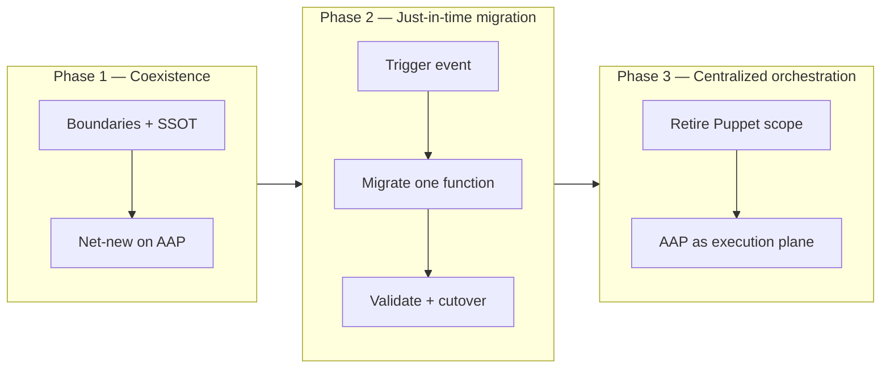

# Coexistence and Technological Evolution Strategy (AAP & Puppet)

To optimize resource allocation and eliminate operational risk, evolution from **legacy configuration management** (Puppet) to **centralized orchestration** ([Red Hat Ansible Automation Platform](https://www.redhat.com/en/technologies/management/ansible) — AAP) follows a **three-phased, just-in-time** approach.

This standard applies when Puppet (or similar CM) remains in production while Ansible automation grows under this governance monorepo (`ai-auto-skills` + `ai-auto-deliveries`).

---

## 1. Principles

| Principle | Meaning |
|-----------|---------|
| **No big-bang** | Do not mass-migrate entire estates in one change window. |
| **Just-in-time** | Migrate a **capability** when there is a justified trigger (change, project, OS lifecycle, incident remediation). |
| **Single owner per resource** | At any moment, one system is authoritative for a given configuration slice — never Puppet and Ansible applying conflicting desired state. |
| **Inventory truth** | CMDB / inventory documents **who owns what** until Phase 3 sign-off retires Puppet for that scope. |
| **Risk proportional to profile** | Use **light / standard / heavy** checklists from [create-new-automation-step-by-step.md](../guides/create-new-automation-step-by-step.md). |

---

## 2. Three phases (overview)



| Phase | Name | Goal | Puppet | Ansible / AAP |
|-------|------|------|--------|----------------|
| **1** | **Coexistence** | Safe parallel operation with clear boundaries | Retains incumbent configuration scope | Net-new capabilities, orchestration, workflows; delivery collection in `deliveries/automation/` |
| **2** | **Just-in-time migration** | Move one capability when touched | Authoritative until signed cutover for that slice | Implements replacement role/playbook; tested in lower environments |
| **3** | **Centralized orchestration** | Puppet retired per inventory group | Decommissioned classes/nodes for migrated scope | AAP Controller schedules production jobs; audit trail and RBAC |

Phases may **overlap by landscape**: production hosts can sit in Phase 1 while lab hosts advance to Phase 2. Progress is tracked **per landscape / type / function**, not by calendar alone.

---

## 3. Phase 1 — Coexistence

### 3.1 Establish boundaries

1. **Inventory map** — For each host group, record:
   - Configuration **owner** (Puppet vs Ansible)
   - Puppet classes / modules in scope
   - Planned Ansible **function role** (if known)
2. **Conflict matrix** — List resources both tools could touch (packages, files, services, users). Mark **excluded** from Ansible until Phase 2 cutover.
3. **SSOT** — External data (CMDB, IPAM, secrets) has one agreed source; see [inventory-ssot-integration.md](../operations/inventory-ssot-integration.md).

### 3.2 Operating rules

| Rule | Rationale |
|------|-----------|
| **Net-new on Ansible** | New capabilities ship as roles in the delivery collection, not new Puppet modules. |
| **No duplicate enforcement** | If Puppet manages `ntp`, Ansible must not manage `ntp` on the same host until cutover. |
| **Read-only discovery OK** | Ansible facts / audit playbooks that do not change state are allowed in Phase 1. |
| **Document exceptions** | Temporary dual-run requires CAB + written rollback (heavy profile). |

### 3.3 AAP in Phase 1

- Controller may run **lab / pre-production** jobs before production Puppet retirement.
- Production execution for **migrated** functions only after Phase 2 cutover checklist passes.
- Execution environments pin collection versions — see [collections-and-execution-environments.md](collections-and-execution-environments.md).

### 3.4 Exit criteria (ready for Phase 2 on a slice)

- [ ] Ownership row exists in inventory map for the target group
- [ ] Conflict matrix reviewed for that function
- [ ] Ansible role design approved ([design-and-build.md](../lifecycle/design-and-build.md))
- [ ] Trigger event recorded (ticket / project ID)

---

## 4. Phase 2 — Just-in-time migration

Migrate **one function** (one role in the delivery collection) when a trigger fires — not before.

### 4.1 Typical triggers

| Trigger | Example |
|---------|---------|
| **Planned change** | OS major upgrade, middleware version bump |
| **Project** | New landscape rollout, datacenter move |
| **Operational pain** | Puppet drift, slow change lead time on that tier |
| **Security / compliance** | Required control easier to implement in Ansible |

### 4.2 Migration workflow

1. **Intake** — Profile (light / standard / heavy); link Puppet class → Ansible function role name.
2. **Implement** — Role under `deliveries/automation/roles/<function>/`; parity checklist vs Puppet behavior.
3. **Test** — Molecule / lab / pre-prod; check mode; second run `changed=0`.
4. **Cutover plan** — Order: disable Puppet class → run Ansible job → verify → monitor.
5. **Rollback** — Re-enable Puppet class; document Controller job ID and collection version.
6. **Sign-off** — Operations + application owner (standard/heavy); update inventory map owner to **Ansible**.

Narrative for regulated change: [example-enterprise-change-flow.md](../examples/example-enterprise-change-flow.md).

### 4.3 Parity and drift

| Check | Action |
|-------|--------|
| Functional parity | Compare Puppet catalog vs Ansible managed resources on sample hosts |
| Idempotency | No unintended changes on second Ansible run |
| Puppet noop | Run Puppet in noop after cutover; expect no corrective changes for migrated class |
| CMDB | Update configuration owner field |

### 4.4 Exit criteria (ready for Phase 3 on a slice)

- [ ] Production cutover successful for all hosts in scope
- [ ] Puppet class removed or marked deprecated in code
- [ ] Runbook and Controller job template in operations handover
- [ ] No open parity defects

---

## 5. Phase 3 — Centralized orchestration

### 5.1 Goals

- **AAP** is the default **execution and audit plane** for migrated configuration.
- **Puppet** agents / classes for migrated scope are **retired** (not merely disabled).
- Automation backlog prioritizes **remaining** Puppet-only functions using Phase 2 triggers.

### 5.2 Controller operations

| Topic | Document |
|-------|----------|
| Job templates, workflows | [controller-and-workflows.md](../operations/controller-and-workflows.md) |
| RBAC, credentials | Platform team + security review |
| Version pinning | Collection release in Git submodule pointer |

### 5.3 Decommission Puppet (per scope)

1. Confirm no hosts in inventory map list Puppet as owner for that function.
2. Remove node classification / Hiera data for retired classes.
3. Archive Puppet module repo tag for audit retention.
4. **Auditor mode** — Scan delivery collection for legacy patterns; see [AGENTS.md](../../AGENTS.md).

### 5.4 Steady state

- New work follows [create-new-automation-step-by-step.md](../guides/create-new-automation-step-by-step.md).
- Phase 3 does not mean “no Puppet anywhere” until **full estate** completes migration — track **percentage by landscape**, not a single flag.

---

## 6. Governance and AI assistance

| Activity | Mode / skill |
|----------|----------------|
| Scan migrated roles for debt | **Mode 1 — Auditor** · [automation-auditor](../../skills/automation-auditor/SKILL.md) |
| Build replacement role | **Mode 2 — Architect** · [automation-new-automation](../../skills/automation-new-automation/SKILL.md) |
| Update this strategy in white book | **Mode 3 — Librarian** · [automation-librarian](../../skills/automation-librarian/SKILL.md) |

Example prompt:

```text
Read AGENTS.md. Mode 2 — Architect.

We are in Phase 2 just-in-time migration: Puppet class `profile::nginx` on middleware tier.
Propose Ansible function role structure in deliveries/automation/ and cutover checklist.
Profile: Standard.
```

More prompts: [ai-prompt-examples.md](../guides/ai-prompt-examples.md).

---

## 7. Metrics (optional)

| Metric | Use |
|--------|-----|
| % hosts by phase per landscape | Portfolio reporting |
| Functions migrated per quarter | Capacity planning |
| Failed cutovers / rollbacks | Process improvement |
| Puppet noop corrective changes post-cutover | Parity validation |

---

## 8. Related documents

- [landscape-type-function-component.md](landscape-type-function-component.md)
- [monorepo-layout.md](monorepo-layout.md)
- [lifecycle/automation-lifecycle-overview.md](../lifecycle/automation-lifecycle-overview.md)
- [operations/inventory-ssot-integration.md](../operations/inventory-ssot-integration.md)
