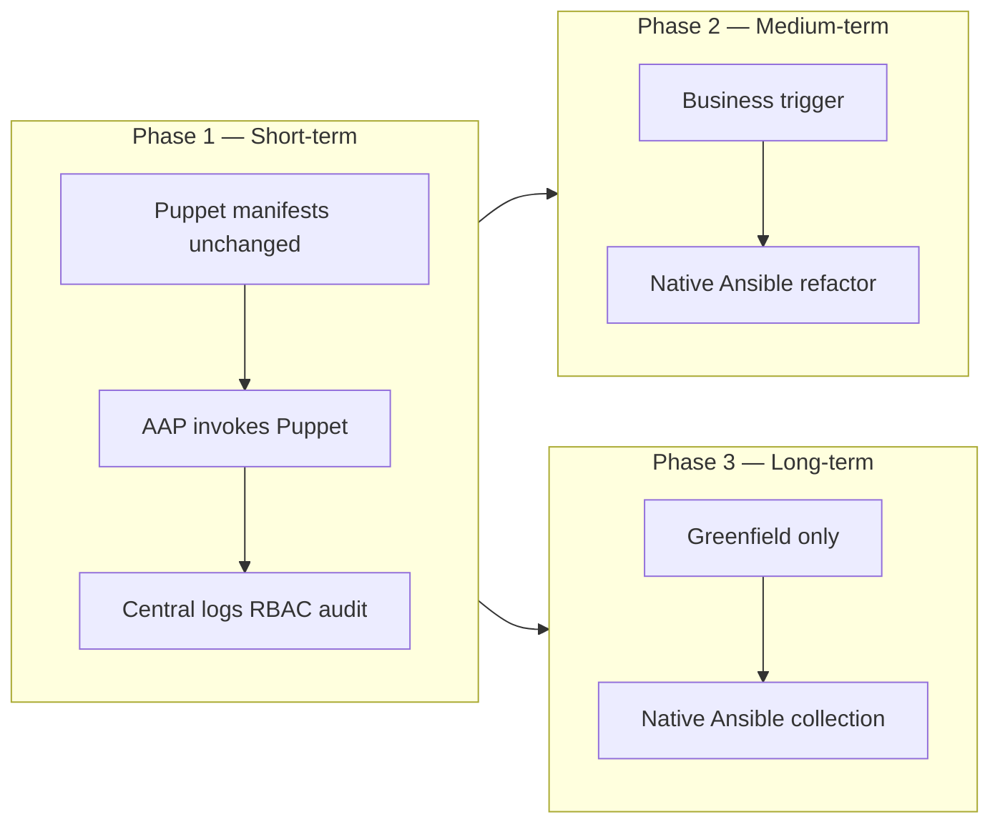
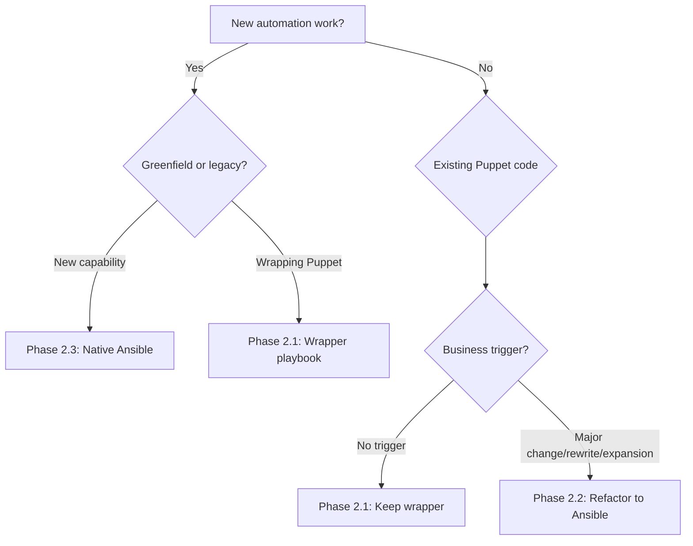

# Coexistence and Technological Evolution Strategy (AAP & Puppet)

> Part of [Strategic Proposal: Automation Governance Model and Evolution with AAP](../governance/strategic-proposal-aap-governance-evolution.md) (v1.0).

To optimize resource allocation and eliminate operational risk, evolution from **legacy configuration management** (Puppet) to **centralized orchestration** (AAP) follows a **three-phased, just-in-time** approach — **not** rip-and-replace.

---

## Overview



| Phase | Official name | Puppet | AAP / Ansible |
|-------|---------------|--------|---------------|
| **2.1** | **Centralized orchestration** (short-term) | Manifests/modules **remain active** | **Orchestrator of orchestrators** — schedules and audits Puppet runs |
| **2.2** | **On-demand refactoring** (medium-term) | Unchanged modules run via Phase 1 **until** trigger | **Native Ansible** replaces Puppet for that module only |
| **2.3** | **Native new developments** (long-term) | Not used for **new** scope | **Exclusive** standard for greenfield |

---

## Decision tree: Which phase?



| If... | Then phase | Action |
|-------|------------|--------|
| New capability, no legacy | **2.3** | Native Ansible only |
| Existing Puppet, no change needed | **2.1** | Keep wrapper indefinitely |
| Existing Puppet + business trigger | **2.2** | Refactor specific module |
| Need to centralize Puppet tracking | **2.1** | Add wrapper playbook |

---

## 2.1. Phase 1: Centralized orchestration (short-term)

Existing Puppet manifests and modules remain active (tight integration with parallel infrastructure teams). **Execution control moves to AAP.**

### Orchestrator of orchestrators

AAP is the **master scheduler and auditor**, invoking Puppet agents from Ansible playbooks using the certified **`community.general.puppet`** module.

**Skill for AI/humans:** [automation-puppet-orchestrate](../../skills/automation-puppet-orchestrate/SKILL.md).

### Native operational mapping

| Ansible / AAP | Puppet | Purpose |
|---------------|--------|---------|
| `noop: "{{ ansible_check_mode }}"` | Puppet noop | Dry-run / impact verification without changes |
| `tags` / `skip_tags` | Puppet tags | Surgical execution of specific resources, not full heavy manifests |
| `env: "{{ _puppet_environment }}"` | Puppet environment | Respects lifecycle boundaries (e.g. development, production) |
| `summarize: true` | Run summary | Injects Puppet run summaries into **AAP job logs** |

### Example task (reference pattern)

```yaml
- name: Apply Puppet catalog via AAP orchestration
  community.general.puppet:
    noop: "{{ ansible_check_mode }}"
    tags: "{{ _puppet_tags | default(omit) }}"
    skip_tags: "{{ _puppet_skip_tags | default(omit) }}"
    environment: "{{ _puppet_environment }}"
    summarize: true
  async: "{{ _puppet_async | default(omit) }}"
  poll: "{{ _puppet_poll | default(omit) }}"
```

### Prohibited patterns

| Do not | Use instead |
|--------|-------------|
| `shell: puppet agent -t` | `community.general.puppet` module |
| Module `timeout:` parameter (deprecated) | Task-level `async` / `poll` |
| Bare `puppet` module name | FQCN `community.general.puppet` |

### Business value (Phase 1)

- Centralized **logs**, **RBAC**, and **compliance tracking** in AAP
- **No changes** to original Puppet code required for initial centralization
- Check mode on playbook → noop on Puppet for risk-free verification

### Exit criteria (candidate for Phase 2)

- [ ] Wrapper playbook and job template in AAP with signed runbook
- [ ] Official **business request** for major functional change, architectural rewrite, or scope expansion (see §2.2)

---

## 2.2. Phase 2: On-demand refactoring and evolution (medium-term)

**Massive bulk migrations are strictly prohibited.**

Legacy Puppet that satisfies current business requirements continues via **Phase 1 wrapper playbooks indefinitely** until a qualifying trigger occurs.

### Trigger-based migration only

Refactor a Puppet module into **native Ansible** only when an official request demands:

| Trigger | Description |
|---------|-------------|
| **Major functional modification** | Behavior change beyond parameters/tags |
| **Architectural rewrite** | New platform, tier split, or dependency model |
| **Scope expansion** | Additional OS, region, or tenant class |

**Not** a trigger: routine noop runs, log aggregation, RBAC-only changes, or “migrate because Ansible exists.”

### Technical debt reduction

During translation:

- Remove legacy Ansible anti-patterns (`with_items`, bare `item`, non-FQCN)
- Apply **`_` / `__` variable rules** and [coding-style.md](../development/coding-style.md)
- One **function role** in `deliveries/automation/roles/rolename/`
- Profile **light / standard / heavy** per [create-new-automation-step-by-step.md](../guides/create-new-automation-step-by-step.md)

### Workflow

1. Intake + approved trigger (ticket)
2. **Builder mode** — native role design; human Architect reviews Puppet ↔ Ansible parity
3. Test: lab → pre-prod; check mode; idempotency
4. Cutover: disable Puppet class for scope → native AAP job → Puppet noop validation
5. Retain Phase 1 wrapper for **non-migrated** classes on same host

Change narrative: [example-enterprise-change-flow.md](../examples/example-enterprise-change-flow.md).

---

## 2.3. Phase 3: Native new developments in AAP (long-term)

**Ansible is the absolute standard** for new work.

| Scope | Rule |
|-------|------|
| Greenfield infrastructure | Native Ansible only (collection, roles, playbooks) |
| Cloud-native services | Native Ansible only |
| Application configuration (new) | Native Ansible only |
| Legacy Puppet (no trigger) | Remains Phase 1 orchestration |

All new content lives in **`ai-auto-deliveries`** (`deliveries/automation/`). Do not author new Puppet modules for net-new capabilities.

---

## Governance and AI assistance

| Phase | Activity | Mode | Skill |
|-------|----------|------|-------|
| 1 | Wrapper playbooks | Builder | [automation-puppet-orchestrate](../../skills/automation-puppet-orchestrate/SKILL.md) |
| 2 | Puppet → Ansible refactor | Builder | [automation-new-automation](../../skills/automation-new-automation/SKILL.md) |
| 2 | PR / policy scan | Auditor | [automation-auditor](../../skills/automation-auditor/SKILL.md) |
| Any | Update strategy | Librarian | [automation-librarian](../../skills/automation-librarian/SKILL.md) |

Prompts: [ai-prompt-examples.md](../guides/ai-prompt-examples.md).

---

## Quick reference card

| Question | Answer |
|----------|--------|
| **Can I migrate all Puppet to Ansible now?** | No. Bulk migrations prohibited. Use Phase 1 wrappers. |
| **When can I refactor Puppet to Ansible?** | Phase 2 — only with approved business trigger (major change/rewrite/expansion). |
| **New capability for greenfield?** | Phase 3 — native Ansible only, no Puppet. |
| **Puppet works fine, no change needed?** | Phase 1 — keep wrapper indefinitely. |
| **Module for wrapper playbooks?** | `community.general.puppet` with FQCN, `summarize: true`, `noop: "{{ ansible_check_mode }}"`. |
| **Where do wrappers live?** | `$AUTOMATION_REPO` (deliveries/automation/). |
| **AI skill for wrappers?** | [automation-puppet-orchestrate](../../skills/automation-puppet-orchestrate/SKILL.md). |
| **AI skill for refactoring?** | [automation-new-automation](../../skills/automation-new-automation/SKILL.md) + human review. |

---

## Related documents

- [strategic-proposal-aap-governance-evolution.md](../governance/strategic-proposal-aap-governance-evolution.md)
- [controller-and-workflows.md](../operations/controller-and-workflows.md)
- [inventory-ssot-integration.md](../operations/inventory-ssot-integration.md)
- [devspaces-workspace.md](../guides/devspaces-workspace.md)
