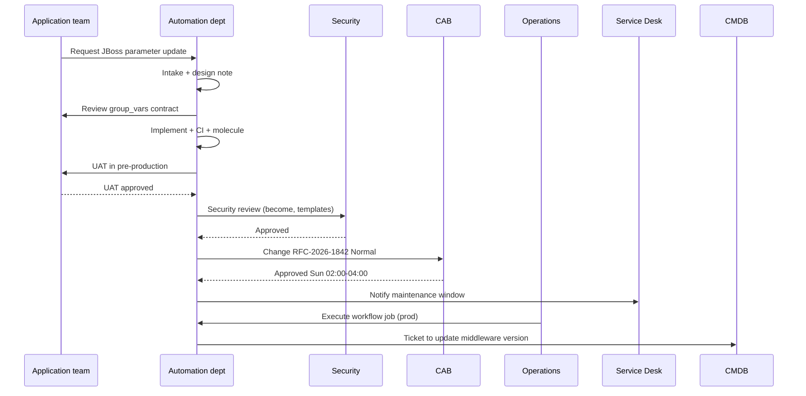

# Example: Change Flow in a Spanish Enterprise Context

End-to-end scenario tying **governance**, **CAB**, and **automation** for a production deployment.

---

## 1. Scenario

**Goal:** Deploy updated `jboss` role to middleware tier in production via Ansible Automation Platform.

**Teams involved:**

| Team | Role in this change |
|------|---------------------|
| Application (Mantenimiento aplicaciones) | UAT sign-off on JBoss settings |
| Systems (Sistemas) | OS compatibility confirmation |
| Automation department | Code, tests, job template |
| Information Security | Review privileged template |
| CAB (Comité de cambios) | Approve window |
| Service Desk (CAU) | Customer communication if needed |
| CMDB | Update To-Be version after success |
| NOC | Monitor job failure alerts |

---

## 2. Timeline

---

## 3. Artefacts

### 3.1 Change record (ITSM)

| Field | Example value |
|-------|---------------|
| Type | Normal |
| Description | Deploy collection `company_middleware` 2.4.0 to production middleware |
| Risk | Medium |
| Backout | Re-run previous EE 2.3.0 job template; restore config from template backup |
| Test evidence | Molecule log, pre-prod job #88421 |
| Automation reference | Controller template `landscape_three_tier_middleware_prod` |

### 3.2 Design note (excerpt)

- **Landscape:** three-tier production
- **Type affected:** middleware only (`--limit middleware`)
- **SSOT:** `group_vars/middleware/jboss.yml` from Application team Git fork
- **Extra vars:** none for desired state; `are_you_really_sure: true` required on destructive tag (not used this change)

### 3.3 CAB presentation (bullet points)

1. What changes for users (brief outage window if any)
2. What automation does (role bump, service restart via handler)
3. Evidence of test
4. Rollback limitations (in-flight sessions)

---

## 4. Execution day

| Step | Actor | Action |
|------|-------|--------|
| T-24h | Service Desk | Post maintenance notice per catalog |
| T-1h | Operations | Verify monitoring green |
| T0 | Operations | Launch workflow with approved change ID in job labels |
| T0+30m | Automation (on-call) | Monitor job; respond to failures |
| T+1h | Application | Smoke test application URL |
| T+24h | CMDB owner | Close CMDB update task |
| T+5d | CAB | PIR only if incident; else skip |

---

## 5. What went wrong (example PIR triggers)

| Issue | Likely cause | Process fix |
|-------|--------------|-------------|
| Wrong JBoss version in prod | Extra var override used | Ban prod extra vars in policy |
| Partial cluster config | `--limit` too narrow | Document limit rules in runbook |
| CMDB drift | No post-change task | Add CMDB ticket to standard checklist |
| CAB rejected at last minute | Security not engaged early | Shift-left security in design |

---

## 6. Mapping to white paper sections

| Topic | Document |
|-------|----------|
| Stakeholders | [../governance/organizational-model-and-stakeholders.md](../governance/organizational-model-and-stakeholders.md) |
| RACI | [../governance/roles-and-responsibilities.md](../governance/roles-and-responsibilities.md) |
| Test/promote | [../lifecycle/test-and-promote.md](../lifecycle/test-and-promote.md) |
| Controller | [../operations/controller-and-workflows.md](../operations/controller-and-workflows.md) |

---

## 7. Related examples

- [example-three-tier-landscape.md](example-three-tier-landscape.md)
- [example-role-interface.md](example-role-interface.md)
