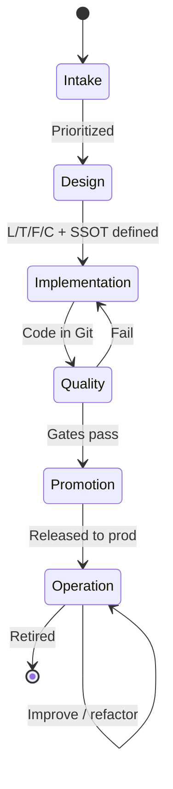

# Automation Lifecycle Overview

Every automation asset follows the **six-stage enterprise lifecycle**: **Intake → Design → Implementation → Quality → Promotion → Operation & improvement**.

Retirement is handled within Operation & improvement when an asset is superseded.

---

## Six stages

| Stage | Purpose | Entry criteria | Exit criteria | Document |
|-------|---------|----------------|---------------|----------|
| **1 — Intake** | Demand management, priority, success criteria | Problem described | Ticket accepted, owner assigned | [intake-and-prioritization.md](intake-and-prioritization.md) |
| **2 — Design** | L/T/F/C, SSOT, execution environments | Intake approved | Structure + interfaces documented | [design-and-build.md](design-and-build.md) |
| **3 — Implementation** | Roles, playbooks, naming, modular design | Design signed | Code in Git, CI green | [design-and-build.md](design-and-build.md), [../development/](../development/) |
| **4 — Quality** | Pre-commit, ansible-lint, Molecule idempotency | Build complete | Lint + tests pass; UAT if required | [../quality/](../quality/), [test-and-promote.md](test-and-promote.md) |
| **5 — Promotion** | Dev → Pre-Prod → Prod via GitOps / AAP | Quality pass | Prod Controller + CAB (if heavy) | [test-and-promote.md](test-and-promote.md) |
| **6 — Operation & improvement** | Metrics, refactoring, debt removal | Released | SLAs monitored; improvements scheduled | [operate-and-improve.md](operate-and-improve.md) |

---

## Artefacts per stage

| Stage | Artefacts |
|-------|-----------|
| Intake | Ticket, success criteria, effort profile (light / standard / heavy) |
| Design | L/T/F/C map, variable contract, inventory SSOT, short design note |
| Implementation | Git branch/PR, roles/playbooks, README, argument_specs |
| Quality | CI logs, molecule report, pre-commit evidence |
| Promotion | Version tag, change record, runbook, Controller job template |
| Operation | Schedules, monitoring dashboard, improvement backlog |

---

## Continuous improvement

Automation is never "done." Schedule:

- **Quarterly:** lint rule updates, collection bumps, GPA diff review (Librarian mode)
- **Annually:** access review on Controller, credential audit
- **Per major OS release:** platform variable and integration test refresh

---

## Related documents

- [../01-main-guide.md](../01-main-guide.md)
- [../governance/governance-as-code-ai-enforcement.md](../governance/governance-as-code-ai-enforcement.md)
- Sub-stage guides in this directory
