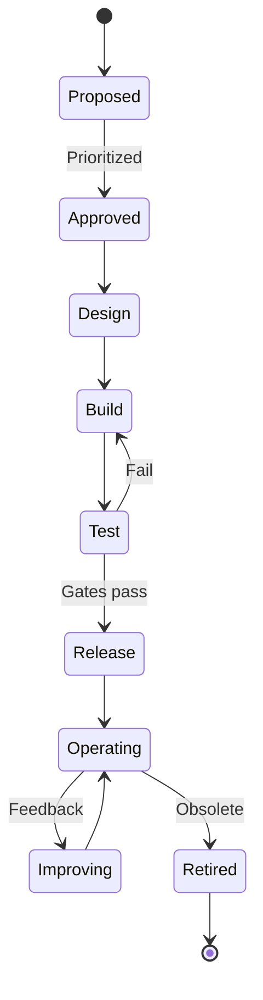

# Automation Lifecycle Overview

Every automation asset has a lifecycle: **propose → design → build → test → release → operate → improve → retire**.

---

## Phase summary

| Phase | Entry criteria | Exit criteria | Document |
|-------|----------------|-------------|----------|
| **Proposed** | Problem described | Ticket accepted | [intake-and-prioritization.md](intake-and-prioritization.md) |
| **Approved** | Value/risk assessed | Owner assigned | [intake-and-prioritization.md](intake-and-prioritization.md) |
| **Design** | Approved | Structure + SSOT + interfaces documented | [design-and-build.md](design-and-build.md) |
| **Build** | Design signed | Code in Git, CI green | [design-and-build.md](design-and-build.md) |
| **Test** | Build complete | UAT + check mode + security (if needed) | [test-and-promote.md](test-and-promote.md) |
| **Release** | Test pass | Prod Controller + CAB | [test-and-promote.md](test-and-promote.md) |
| **Operating** | Released | SLAs monitored | [operate-and-improve.md](operate-and-improve.md) |
| **Improving** | Metrics/debt | Backlog items scheduled | [operate-and-improve.md](operate-and-improve.md) |
| **Retired** | Superseded | Jobs disabled, docs archived | [operate-and-improve.md](operate-and-improve.md) |

---

## Artefacts per phase

| Phase | Artefacts |
|-------|-----------|
| Design | Short design note, variable contract, inventory SSOT map |
| Build | Git branch/PR, roles/playbooks, README, argument_specs |
| Test | CI logs, molecule report, UAT sign-off |
| Release | Version tag, change record, runbook |
| Operate | Job template, schedule, monitoring dashboard |

---

## Continuous improvement

Automation is never "done." Schedule:

- **Quarterly:** lint rule updates, collection bumps, GPA diff review
- **Annually:** access review on Controller, credential audit
- **Per major OS release:** platform variable and integration test refresh

---

## Related documents

- [../01-main-guide.md](../01-main-guide.md)
- Sub-phase guides in this directory
