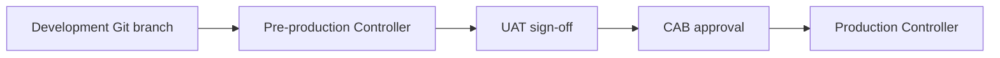

# Test and Promote

## 1. Test pyramid for automation

| Layer | What | Tooling |
|-------|------|---------|
| **Static** | Syntax, lint, yaml style, secrets | **`pre-commit run --all-files`** (mandatory), `ansible-playbook --syntax-check` |
| **Unit** | Plugins, filters | `pytest` (not unittest) |
| **Role integration** | Role against containers/VMs | Molecule |
| **Integration** | Type playbook + inventory | CI pipeline, dedicated lab |
| **Check mode** | No unintended changes reported | `ansible-playbook --check` |
| **UAT** | Business/ops acceptance | Manual sign-off in pre-prod |

---

## 2. Idempotency and check mode

Production integrations (ticketing, drift detection) rely on accurate `changed` status.

Requirements (from GPA):

- Second run: no changes, no false `changed`
- Check mode: must not fail; must not report changes when none
- Avoid raw `command:` without `changed_when:`; prefer modules

Deep dive: [../quality/idempotency-and-check-mode.md](../quality/idempotency-and-check-mode.md).

---

## 3. Security testing

| Scenario | Security team involvement |
|----------|---------------------------|
| `become: true` on production paths | Review |
| Destructive tags (delete, recreate) | Review + extra var guard pattern |
| Handling credentials | Vault / Controller credential types only |
| Logging sensitive output | `no_log` default true; break-glass extra var documented |

---

## 4. Promotion path (environments)

| Environment | Purpose | Who runs jobs |
|-------------|---------|---------------|
| **Development** | Engineer testing | Automation team |
| **Pre-production** | Integration + UAT | Automation + Application/Ops |
| **Production** | Live systems | Controlled templates; Operations may execute |

**Promotion mechanics:**

1. Merge to main with semantic version tag
2. Build/push execution environment (if collections changed)
3. Sync project on next Controller environment
4. Run smoke playbook on limited `--limit` before full rollout

---

## 5. Production gates

- [ ] **Pre-commit** passes locally and in CI ([../quality/pre-commit.md](../quality/pre-commit.md))
- [ ] Peer review completed ([../quality/code-review-and-linting.md](../quality/code-review-and-linting.md))
- [ ] Change record approved (Normal/Emergency per policy)
- [ ] Runbook linked in job template
- [ ] Rollback limitations documented (not everything is reversible)
- [ ] CMDB To-Be updated or ticket filed for CMDB team
- [ ] Service Desk informed if user-visible window

Spanish enterprise CAB flow example: [../examples/example-spanish-enterprise-change-flow.md](../examples/example-spanish-enterprise-change-flow.md).

---

## 6. Related documents

- [operate-and-improve.md](operate-and-improve.md)
- [../operations/controller-and-workflows.md](../operations/controller-and-workflows.md)
