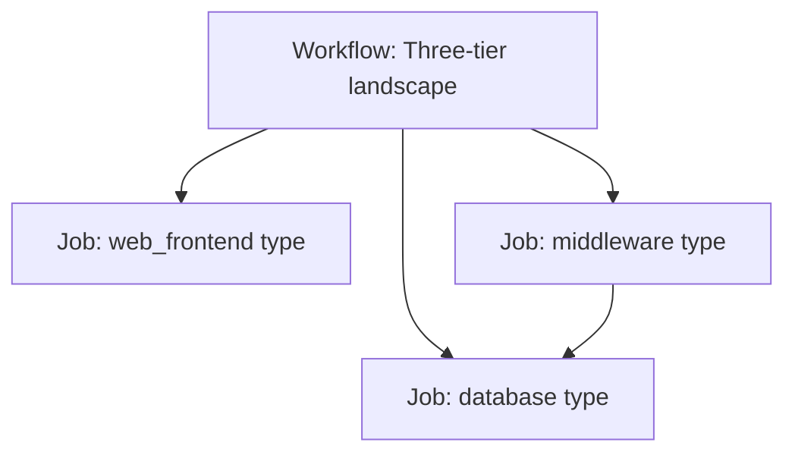

# Controller and Workflows

For **Red Hat Ansible Automation Platform** (Controller / AWX).

---

## 1. Map structures to Controller objects

| GPA level | Controller object |
|-----------|-------------------|
| Landscape | **Workflow job template** |
| Type | **Job template** (one playbook per type) |
| Function | Roles inside project |
| Inventory | **Inventory** (constructed from Git + dynamic sources) |
| Execution | **Execution environment** |

---

## 2. Workflow design

- Use convergence/dependencies for ordering (e.g. database before app only if required)
- Avoid manual "run template 1 then 2" instructions outside Controller

---

## 3. Job template standards

| Field | Standard |
|-------|----------|
| Name | `landscape_type_environment` pattern |
| Description | Link to runbook, change category, owner |
| Limit | Default none; document allowed limit patterns |
| Extra variables | **No** desired state; safety/debug only |
| Credentials | Least privilege; no personal accounts |
| Labels | Environment, cost center, application |

---

## 4. RBAC

| Role (Controller) | Typical enterprise mapping |
|-------------------|----------------------------|
| Admin | Automation platform team only |
| Execute | Operations (approved templates) |
| Read | Auditors, NOC, developers (non-prod) |

Align with **Information Security** access reviews.

---

## 5. Observability

- Export job status to monitoring (failed jobs → NOC ticket)
- Retain job history per compliance retention policy
- Version traceability: project commit + EE image digest on each job

---

## 6. Related documents

- [../architecture/collections-and-execution-environments.md](../architecture/collections-and-execution-environments.md)
- [inventory-ssot-integration.md](inventory-ssot-integration.md)
- [../lifecycle/operate-and-improve.md](../lifecycle/operate-and-improve.md)
