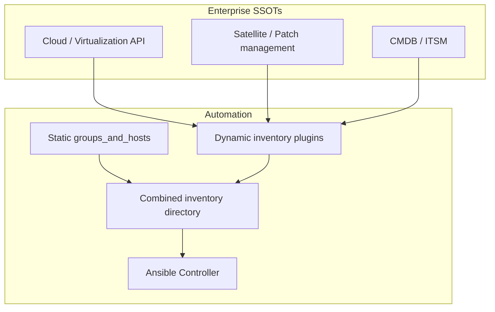

# Inventory and SSOT Integration

---

## 1. Integration architecture



---

## 2. Typical Spanish enterprise SSOT mapping

| Organizational function | Common tools | Inventory data |
|-------------------------|--------------|----------------|
| Cloud / DC virtualization | VMware, RHV, Azure, AWS | Hostname, IP, flavor, zone |
| Linux patch / content | Red Hat Satellite | Content view, activation key |
| ITSM / CMDB | ServiceNow, Jira SM | Owner, environment, SLA tier |
| IPAM / DNS | Infoblox, Microsoft DNS | Static IP To-Be (if not cloud) |
| Monitoring | Zabbix, Prometheus SD | Optional source for discovery only |

**Governance:** CMDB team often **accountable** for To-Be organizational data; automation **consumes** via export or API.

---

## 3. Implementation practices

1. **One inventory directory** per environment (prod/pre/dev)—not multiple `-i` files
2. **Plugin config** in repo: `inventory_aws.yml`, `inventory_satellite.yml`
3. **Static file** only for groups/hosts not in any API
4. **Transform** CMDB exports in CI to `group_vars`—do not hand-edit prod vars without ticket

---

## 4. As-Is / To-Be in integrations

| Source | Usually |
|--------|---------|
| Cloud facts plugin | As-Is |
| CMDB desired state fields | To-Be |
| Manual `host_vars` | To-Be (if no CMDB field) |

Use **different variable names** (`vm_ram_mb_actual` vs `vm_ram_mb_desired`).

---

## 5. CMDB feedback loop

After successful production job:

1. Automation job ID recorded in change
2. Ticket or automated export updates CMDB **To-Be** if deployment changed state
3. Never assume CMDB auto-updates without explicit interface

**Consulted:** CMDB administrator, Change manager.

---

## 6. Satellite example structure

Large variable sets per host:

```
host_vars/sat6.example.com/
├── ansible.yml
└── satellite/
    ├── content_views.yml
    ├── hostgroups.yml
    └── locations.yml
```

Reference: `automation-good-practices/inventories/inventory_satellite/`.

---

## 7. Related documents

- [../development/inventories-and-variables.md](../development/inventories-and-variables.md)
- [../governance/roles-and-responsibilities.md](../governance/roles-and-responsibilities.md)
